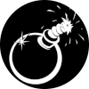

# pyboom

Aprende Python desde cero detonando bombas imaginarias.

Ejemplos para el tutorial - [Doom Presenta: Python desde cero](https://geekl0g.wordpress.com/tag/python-para-detonar-bombas).

The Travelling Vaudeville Villain

